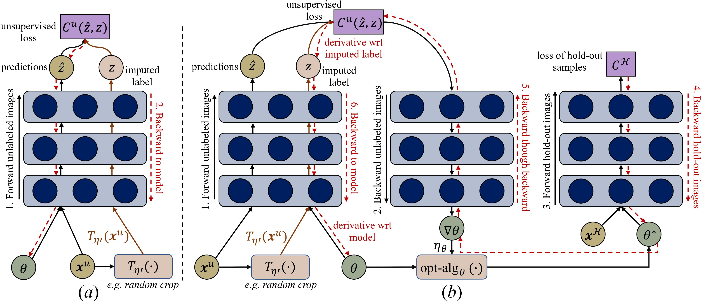

# Learning to Impute: A General Framework for Semi-supervised
This is the implementation of [Learning to Impute: A General Framework for Semi-supervised](https://arxiv.org/pdf/1912.10364.pdf) introduced by [Wei-Hong Li](https://weihonglee.github.io), [Chuan-Sheng Foo](http://ai.stanford.edu/~csfoo/), and [Hakan Bilen](http://homepages.inf.ed.ac.uk/hbilen/index.html). We provide code for our method (L2I) that performs Image Classification on CIFAR-10 and Facial Landmark Regression on AFLW. The repository also contains code for baselines which are compared in our paper. All methods are implemented in Pytorch

<center></center>

Recent semi-supervised learning methods have shown to achieve comparable results to their supervised counterparts while using only a small portion of labels in image classification tasks thanks to their regularization strategies. In this paper, we take a more direct approach for semi-supervised learning and propose learning to impute the labels of unlabeled samples such that a network achieves better generalization when it is trained on these labels. We pose the problem in a learning-to-learn formulation which can easily be incorporated to the state-of-the-art semi-supervised techniques and boost their performance especially when the labels are limited. We demonstrate that our method is applicable to both classification and regression problems including image classification and facial landmark detection tasks.

## Requirements
- Python 3.6+
- PyTorch 1.0 (or newer version)
- torchvision 0.2.2 (or newer version)
- tensorboardX
- progress
- matplotlib
- numpy


## Image Classification on CIFAR-10

### Train Baselines

Train the MT by 250 labeled data of CIFAR-10 dataset:
```
python train-MT.py --gpu <gpu_id> --n-labeled 250 --out cifar10MT@250
```

Train the MM by 250 labeled data of CIFAR-10 dataset:
```
python train-MM.py --gpu <gpu_id> --n-labeled 250 --out cifar10MM@250
```

### Train Our L2I

*We provide code for L2I-O (modeling missing labels as the **O**utput of the model) and L2I-L (modeling missing labels as **L**earnable parameters) built on MT.*

Train our L2I-O built on MT by 250 labeled data of CIFAR-10 dataset:
```
python train-L2I-O.py --gpu <gpu_id> --n-labeled 250 --out cifar10L2IO@250
```

Train our L2I-L built on MT by 250 labeled data of CIFAR-10 dataset:
```
python train-L2I-L.py --gpu <gpu_id> --n-labeled 250 --out cifar10L2IL@250
```

### Monitoring training progress
```
tensorboard --port 6006 --logdir cifar10L2IO@250
```


## Facial Landmark Regression on AFLW

### Prepare Dataset
Download the dataset from https://github.com/tomasjakab/imm/. Unzip and place the whole dataset folder in ./data/

### Train Supervised Learning (SL) 
Train SL by full training data on AFLW dataset:
```
python train-SL.py --gpu <gpu_id> --n-labeled -1 --out aflwSL@-1
```
Train SL by 1% of labeled data on AFLW dataset:
```
python train-SL.py --gpu <gpu_id> --n-labeled 0.01 --out aflwSL@0.01
```

### Train Baselines
Train PL by 1% of labeled data on AFLW dataset:
```
python train-PL.py --gpu <gpu_id> --n-labeled 0.01 --out aflwPL@0.01
```

Train MT by 1% of labeled data on AFLW dataset:
```
python train-MT.py --gpu <gpu_id> --n-labeled 0.01 --out aflwMT@0.01
```

### Train Our L2I
*We provide code for L2I-O (modeling missing labels as the **O**utput of the model) and L2I-L (modeling missing labels as **L**earnable parameters) built on MT.*

Train our L2I-O built on MT by 1% labeled data on AFLW dataset:
```
python train-L2I-O.py --gpu <gpu_id> --n-labeled 0.01 --out aflwL2IO@0.01
```

Train our L2I-L built on MT by 1% labeled data on AFLW dataset:
```
python train-L2I-L.py --gpu <gpu_id> --n-labeled 0.01 --out aflwL2IL@0.01
```


### Monitoring training progress
```
tensorboard --port 6006 --logdir aflwL2IO@0.01
```


## Contact
For any question, you can contact `w.h.li@ed.ac.uk`.

## Citation
If you find this code to be useful in your work and use it for a publication, please kindly cite:
```
@article{li2019learning,
  title={Learning to impute: A general framework for semi-supervised learning},
  author={Li, Wei-Hong and Foo, Chuan-Sheng and Bilen, Hakan},
  journal={arXiv preprint arXiv:1912.10364},
  year={2019}
}
```


